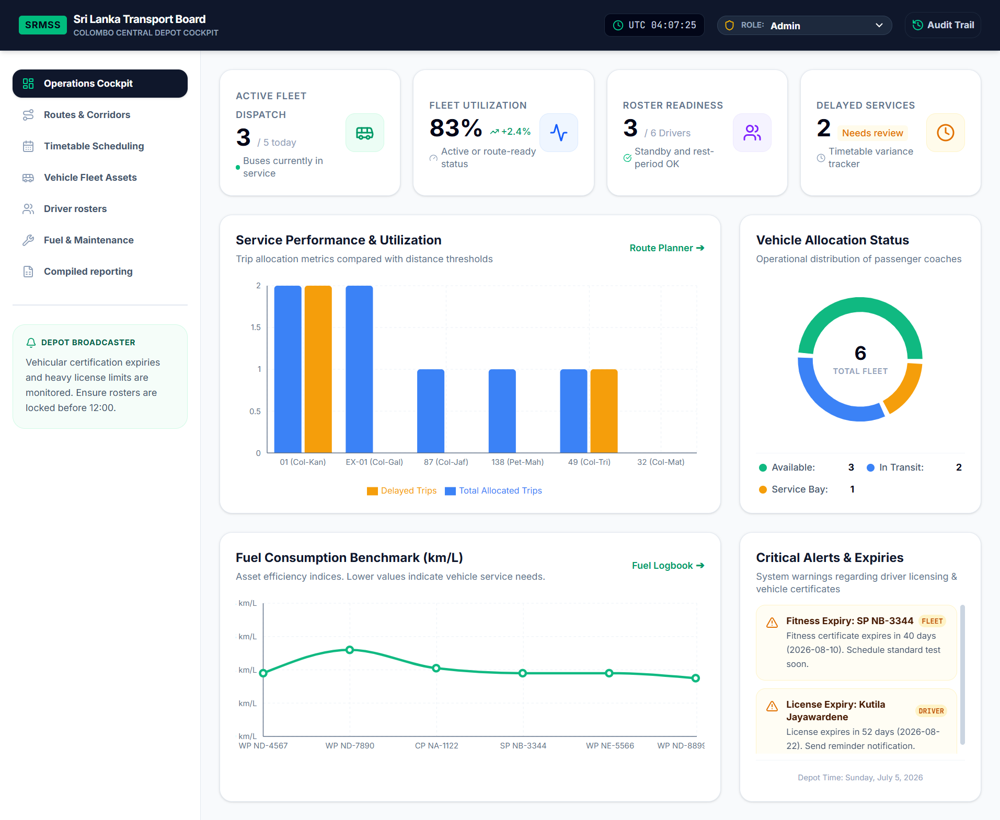

<div align="center">

</div>

# Smart Route Management and Scheduling System

> A web dashboard for managing transit routes, schedules, and live vehicle tracking. Built with React, Vite, and Leaflet.

**Features**
- Route creation and editing
- Schedule management and assignments
- Live bus tracking with map visualization
- Distance, ETA and speed calculations utilities
- Reporting and analytics dashboard components

**Tech stack**
- Framework: React + Vite
- Language: TypeScript
- Maps: Leaflet + react-leaflet + leaflet-routing-machine
- Charts: Recharts
- Styling: Tailwind CSS

**Quick Start**

Prerequisites:

- Node.js 18+ and npm

Install dependencies:

```bash
npm install
```

Run development server:

```bash
npm run dev
```

Build for production:

```bash
npm run build
```

Preview production build:

```bash
npm run preview
```

Useful scripts (from `package.json`):

- `dev` — start Vite dev server on port 3000
- `build` — produce production build
- `preview` — preview built app
- `clean` — remove `dist` and `server.js`
- `lint` — run TypeScript type-check

**Project Structure**

- `src/` — application source
  - `components/` — React pages and UI components
  - `data/` — mock data
  - `hooks/` — custom React hooks (live tracking, routes)
  - `services/` — integration with GPS, routing and map services
  - `utils/` — helpers: `calculateDistance`, `calculateETA`, etc.
- `assets/` — images and static assets
- `index.html`, `vite.config.ts`, `tsconfig.json`

Key files:

- `src/RouteMap.tsx` — map view and routing
- `src/ScheduleManagement.tsx` — scheduling UI
- `src/hooks/useLiveBusTracking.ts` — live position updates

**Environment & Configuration**

If you need to provide API keys or environment variables, add a `.env` file at the project root and reference them from your code using `import.meta.env` (Vite).

**Development Notes**

- The app uses Leaflet for mapping and `leaflet-routing-machine` for route drawing and waypoints.
- Mock data is available in `src/data/mockData.ts` for local development.
- Type-checking is enforced via the `lint` script (`tsc --noEmit`).

**Contributing**

Contributions are welcome. Open an issue or submit a PR with a clear description of changes and any setup steps needed to validate them.

**License**

This project is provided as-is. Add a license file if you plan to publish.

---

If you want, I can also add a short development checklist, run tests (if any), or create a CONTRIBUTING.md. What would you like next?
